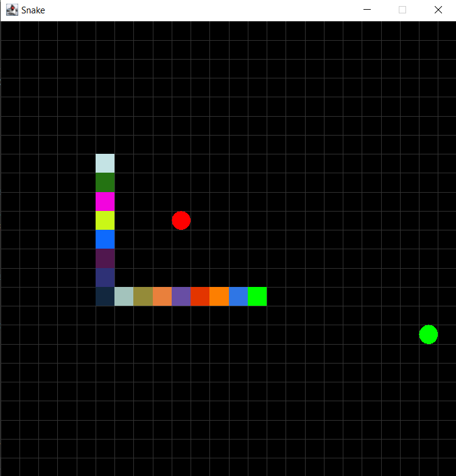
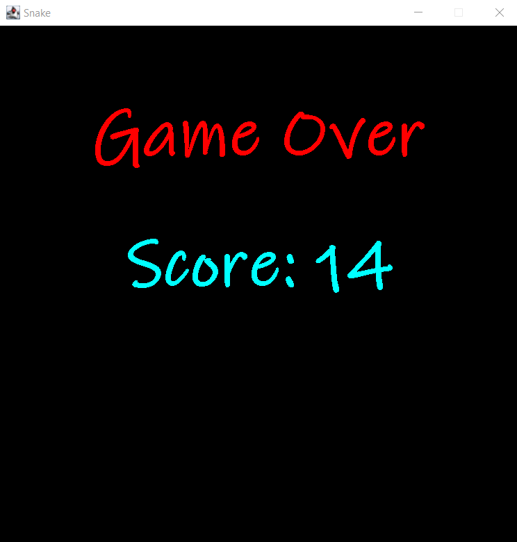

# Snake Game

A simple Snake game implemented in Java using Swing for the graphical user interface.

## Table of Contents

- [Overview](#overview)
- [Features](#features)
- [Installation](#installation)
- [Usage](#usage)
- [Controls](#controls)
- [Screenshots](#screenshots)
- [Contributing](#contributing)
- [License](#license)

## Overview

This project is a classic Snake game where the player controls a snake to collect apples while avoiding bombs and the snake's own body. The game gets progressively faster as more apples are collected.

## Features

- Classic Snake gameplay
- Randomly placed apples and bombs
- Increasing speed as apples are collected
- Game over screen displaying the score
- Colorful snake body

## Installation

1. **Clone the repository:**

    ```sh
    git clone https://github.com/yourusername/snake-game.git
    ```

2. **Navigate to the project directory:**

    ```sh
    cd snake-game
    ```

3. **Compile the Java files:**

    ```sh
    javac GamePanel.java
    ```

4. **Run the game:**

    ```sh
    java GamePanel
    ```

## Usage

- **Start the Game:**
  - Run the compiled `GamePanel` class to start the game.

- **Gameplay:**
  - Use the arrow keys to control the direction of the snake.
  - Collect apples to grow the snake and increase your score.
  - Avoid bombs and the snake's own body.

## Controls

- **Arrow Keys:**
  - `UP` - Move the snake up
  - `DOWN` - Move the snake down
  - `LEFT` - Move the snake left
  - `RIGHT` - Move the snake right

## Screenshots


*Game Start Screen*


*Game Over Screen*

## Contributing

Contributions are welcome! If you have any improvements or new features to add, please follow these steps:

1. Fork the repository.
2. Create a new branch (`git checkout -b feature/your-feature`).
3. Make your changes.
4. Commit your changes (`git commit -m 'Add some feature'`).
5. Push to the branch (`git push origin feature/your-feature`).
6. Open a Pull Request.

## License

This project is licensed under the MIT License - see the [LICENSE](LICENSE) file for details.
